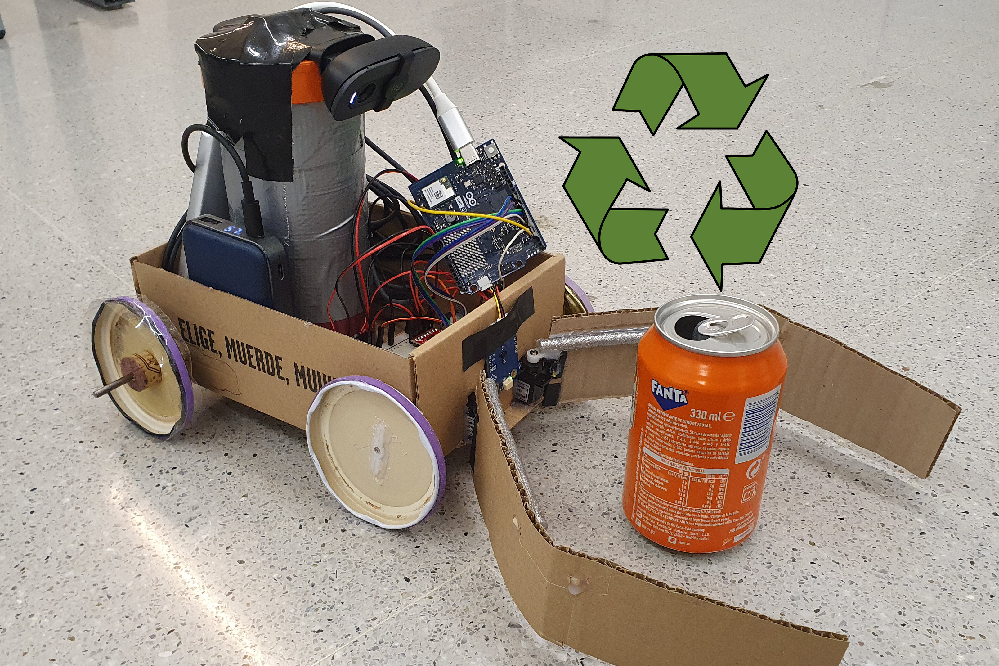

# FestiCleaner

Our FestiCleaner robot autonomously identifies, locates, and cleans trash in real-time, and presents data in an intuitive dashboard. Built using an Arduino Uno Q and recycled cardboard, jar lids, etc. The robot's primary use-case is to clean festivals after events.

## How to Run
1. Connect the robot and a computer to the same network (with appropriate device discovery settings). Firewalls, protected WiFi networks, etc. may cause issues. Self-hosting a hotspot on a phone should work.
2. Configure the Arduino Uno Q to automatically connect to the WiFi network. The following commands may be useful: 
Get the list of saved networks:  
`nmcli -t -f TYPE,UUID,NAME con`  
Delete a specific network. Use this ONLY on the main external network, like HackUPC or phone's hotspot:  
`sudo nmcli c delete <UUID>`  
Connect to a new network:  
`sudo nmcli dev wifi connect <WiFi-SSID> password <WiFi-password>` 
3. To start the robot, connect first the camera to the Arduino and then the battery.
4. With our hotspot, the dashboard can be accessed at [http://192.168.106.126:7000/](http://192.168.106.126:7000/).
